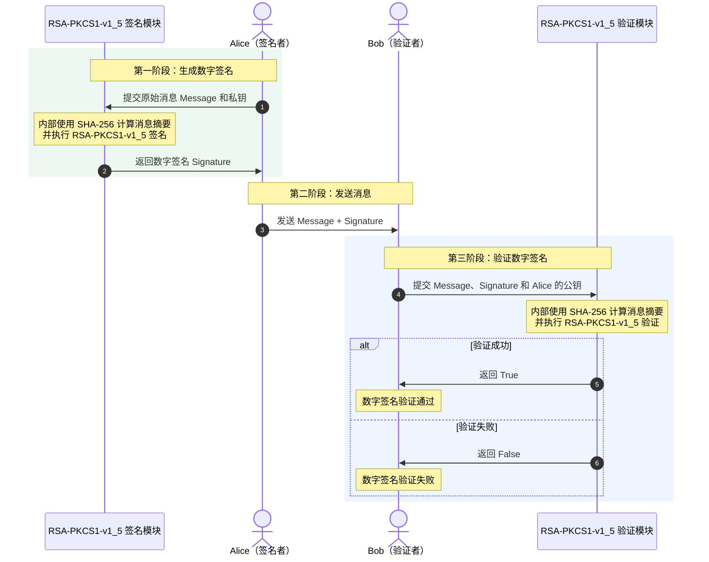
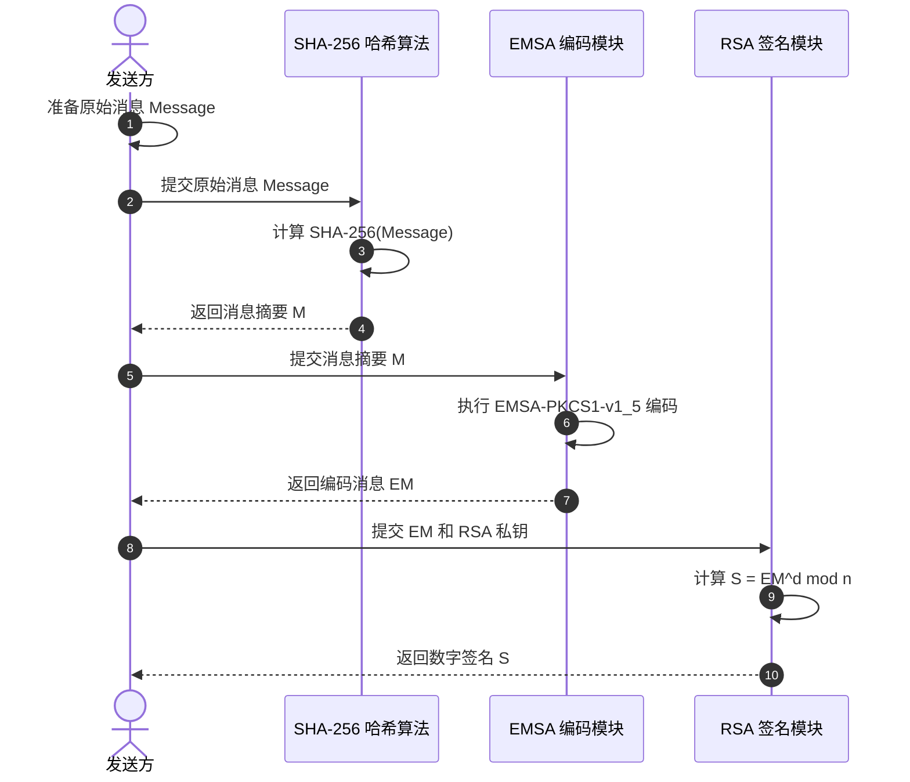
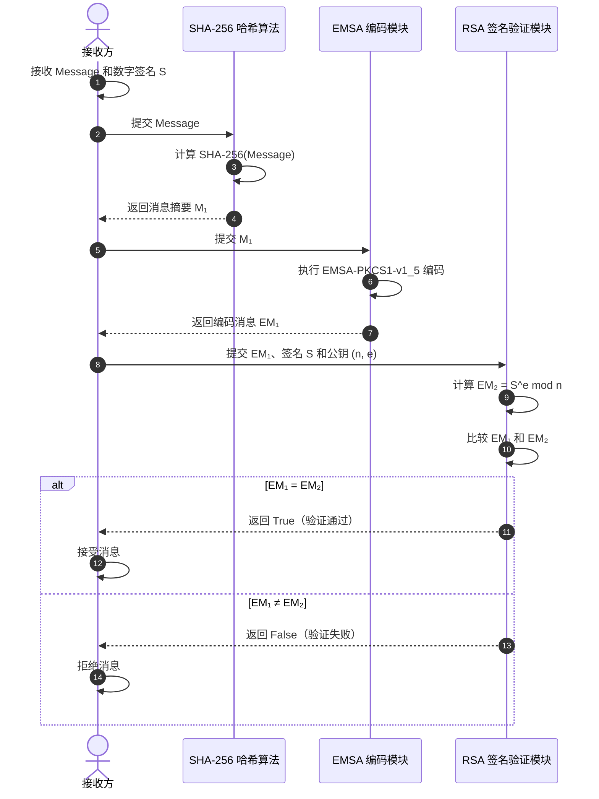

- [数字签名](#数字签名)
  - [数字签名基本流程](#数字签名基本流程)
  - [生成签名](#生成签名)
  - [验证签名](#验证签名)

# 数字签名

## 数字签名基本流程

```mermaid
sequenceDiagram
    autonumber

    participant S as RSA-PKCS1-v1_5 签名模块
    actor A as Alice（签名者）
    actor B as Bob（验证者）
    participant V as RSA-PKCS1-v1_5 验证模块

    rect rgba(22, 163, 74, 0.08)
        Note over A,S: 第一阶段：生成数字签名

        A->>S: 提交原始消息 Message 和私钥
        Note over S: 内部使用 SHA-256 计算消息摘要<br/>并执行 RSA-PKCS1-v1_5 签名
        S->>A: 返回数字签名 Signature
    end

    Note over A,B: 第二阶段：发送消息

    A->>B: 发送 Message + Signature

    rect rgba(59, 130, 246, 0.08)
        Note over B,V: 第三阶段：验证数字签名

        B->>V: 提交 Message、Signature 和 Alice 的公钥

        Note over V: 内部使用 SHA-256 计算消息摘要<br/>并执行 RSA-PKCS1-v1_5 验证

        alt 验证成功
            V->>B: 返回 True
            Note over B: 数字签名验证通过
        else 验证失败
            V->>B: 返回 False
            Note over B: 数字签名验证失败
        end
    end

```

## 生成签名

```mermaid
sequenceDiagram
    autonumber
    actor A as 发送方
    participant H as SHA-256 哈希算法
    participant E as EMSA 编码模块
    participant R as RSA 签名模块

    A->>A: 准备原始消息 Message

    A->>H: 提交原始消息 Message
    H->>H: 计算 SHA-256(Message)
    H-->>A: 返回消息摘要 M

    A->>E: 提交消息摘要 M
    E->>E: 执行 EMSA-PKCS1-v1_5 编码
    E-->>A: 返回编码消息 EM

    A->>R: 提交 EM 和 RSA 私钥
    R->>R: 计算 S = EM^d mod n
    R-->>A: 返回数字签名 S
```

## 验证签名

```mermaid
sequenceDiagram
    autonumber
    actor B as 接收方
    participant H as SHA-256 哈希算法
    participant E as EMSA 编码模块
    participant R as RSA 签名验证模块

    B->>B: 接收 Message 和数字签名 S

    B->>H: 提交 Message
    H->>H: 计算 SHA-256(Message)
    H-->>B: 返回消息摘要 M₁

    B->>E: 提交 M₁
    E->>E: 执行 EMSA-PKCS1-v1_5 编码
    E-->>B: 返回编码消息 EM₁

    B->>R: 提交 EM₁、签名 S 和公钥 (n, e)

    R->>R: 计算 EM₂ = S^e mod n
    R->>R: 比较 EM₁ 和 EM₂

    alt EM₁ = EM₂
        R-->>B: 返回 True（验证通过）
        B->>B: 接受消息
    else EM₁ ≠ EM₂
        R-->>B: 返回 False（验证失败）
        B->>B: 拒绝消息
    end
```