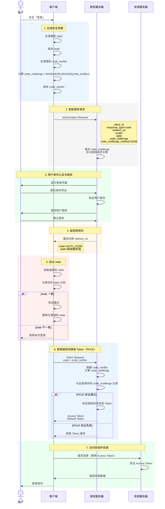

# OpenID Connect 认证流程

```mermaid
sequenceDiagram
    actor U as 用户
    participant C as 客户端
    participant A as 授权服务器
    participant R as 资源服务器

    U->>C: 点击「登录」

    rect rgb(235, 245, 255)
        Note over C: 1. 生成安全参数

        C->>C: 生成随机 state
        C->>C: 保存 state

        C->>C: 生成随机 code_verifier
        C->>C: 计算 code_challenge = BASE64URL(SHA256(code_verifier))
        C->>C: 保存 code_verifier
    end

    rect rgb(245, 245, 245)
        Note over C,A: 2. 发起授权请求

        C->>A: Authorization Request
        Note right of A: client_id<br/>response_type=code<br/>redirect_uri<br/>scope<br/>state<br/>code_challenge<br/>code_challenge_method=S256

        A->>A: 保存 code_challenge<br/>并与授权请求关联
    end

    rect rgb(235, 255, 240)
        Note over U,A: 3. 用户身份认证与授权

        A->>U: 显示登录页面
        U->>A: 提交身份凭证
        A->>A: 验证用户身份
        A->>U: 请求用户授权
        U->>A: 确认授权
    end

    rect rgb(255, 248, 235)
        Note over A,C: 4. 返回授权码

        A-->>C: 重定向到 redirect_uri
        Note right of C: code=AUTH_CODE<br/>state=原始随机值
    end

    rect rgb(255, 240, 240)
        Note over C: 5. 验证 state

        C->>C: 读取返回的 state
        C->>C: 与保存的 state 比较

        alt state 一致
            C->>C: 验证通过
            C->>C: 删除已使用的 state
        else state 不一致
            C-->>U: 拒绝本次登录
        end
    end

    rect rgb(235, 245, 255)
        Note over C,A: 6. 使用授权码换取 Token（PKCE）

        C->>A: Token Request<br/>code + code_verifier

        A->>A: 根据 code_verifier<br/>计算 code_challenge
        A->>A: 与此前保存的 code_challenge 比较

        alt PKCE 验证通过
            A->>A: 验证授权码并签发 Token
            A-->>C: Access Token<br/>Refresh Token
        else PKCE 验证失败
            A-->>C: 拒绝 Token 请求
        end
    end

    rect rgb(235, 255, 240)
        Note over C,R: 7. 访问受保护资源

        C->>R: 请求资源（携带 Access Token）
        R->>R: 验证 Access Token
        R-->>C: 返回资源数据
        C-->>U: 登录成功
    end
```